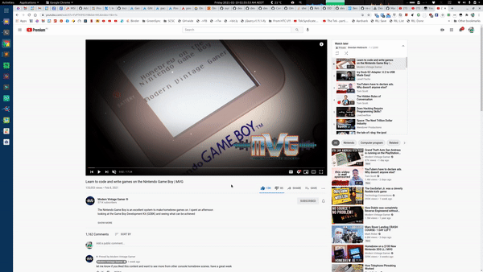
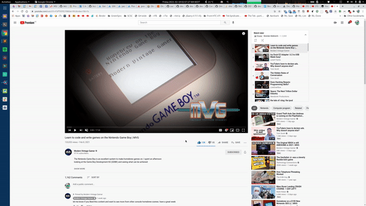

# YouTube Fast Fullscreen Toggle

Avoids the ~3 second lag when entering/exiting fullscreen on a YouTube video - by hiding the heavy fluff while transitioning

## Contents

<!-- MarkdownTOC autolink=true -->

- [Install](#install)
- [Description](#description)
- [Changelog](#changelog)
- [Development](#development)

<!-- /MarkdownTOC -->

## Install

Options:

- From the [Chrome Web Store](https://chrome.google.com/webstore/detail/dggbkbndbcaknaeobfieifmdcncmpaba) (updates will be delayed a few days due to their review process)
- Using [Tampermonkey](https://chrome.google.com/webstore/detail/tampermonkey/dhdgffkkebhmkfjojejmpbldmpobfkfo) - [script](extension/contentScript.js)
- Manually:
  + [Download the CRX file](https://github.com/ZimbiX/youtube-fast-fullscreen-toggle/releases/download/v2.4.0/youtube-fast-fullscreen-toggle-v2.4.0.crx)
  + Browse to `chrome://extensions`
  + Enable the Developer mode setting in the top-right
  + Drag in the file

## Description

There's an annoying lag period when entering/exiting fullscreen on a YouTube video. On my machine, it's normally ~2 seconds; but with a large playlist expanded, it gets up to ~3 seconds. This extension reduces the transition time to almost nothing.

Supported fullscreen transitions:

- Clicking the fullscreen button
- Pressing the F key

Unsupported fullscreen transitions (still slow):

- Double-clicking the video
- Escape
- F11

Note that Firefox doesn't seem to have the same issue as Chrome; so in Firefox the improvement is barely noticeable.

In Vivaldi, there is unfortunately an intermediate step in the fullscreen transition, which I can't seem to do anything to avoid. It appears to be due to the toolbars being hidden/shown at a different moment to when the browser actually enters/leaves fullscreen.

Technical detail:

This bug's been present for years now, and I got so sick of it that I spent one night experimenting to find a way to avoid it - and I found one! The extra HTML content on the page (playlist, recommendations, comments, description, likes, etc.) is pretty heavy, and when you toggle fullscreen, YouTube moves it around in the DOM, which ends up incuring a fair bit of processing. I've worked out that it's significantly faster to hide that extra content before transitioning, then display it again afterwards once it's reached its new position.

Before:



After:



## Changelog

For the changelog, see [Releases](https://github.com/ZimbiX/youtube-fast-fullscreen-toggle/releases)

## Development

To publish a new release:

```
./scripts/publish <version>
```
